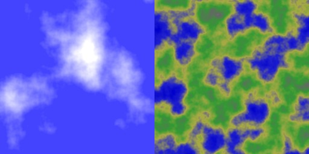

Texture Generator
=================

This is an incomplete command line tool that generates textures based on a JSON spec.
Parts of the project are inspired by mrdoob's [texgen.js](https://github.com/mrdoob/texgen.js).

## Generator Functions:

* constant color
* random non-coherent noise
* perlin noise
* simplex noise
* fractal Brownian motion (fBm)
* gradient map
* sin
* or / xor
* pow ("clouds")
* rectangle
* circle
* custom mathematical expression

## Tool Features

* TGA output
* Watch files for changes and automatically regenerate textures
* Files can contain multiple output textures
* Outputs how long each texture took to generate

## Usage Example

	$ cat << EOF > test.json
	{
		"size": [ 256, 256 ],
		"out": "test.tga",
		"ops": [
			{ "add": "xor", "tint": [ 1.0, 0.5, 0.7 ] },
			{ "add": "sinx", "freq": 0.004, "tint": [ 0.25, 0.0, 0.0 ] },
			{ "sub": "siny", "freq": 0.004, "tint": [ 0.25, 0.0, 0.0 ] },
			{ "add": "sinx", "freq": 0.0065, "tint": [ 0.1, 0.5, 0.2 ] },
			{ "add": "siny", "freq": 0.0065, "tint": [ 0.0, 0.4, 0.5 ] },
			{ "add": "noise", "tint": [ 0.1, 0.1, 0.2 ] }
		]
	}
	EOF
	
	$ gentex test.json

See more examples in the tests-directory.

## Building

You need CMake and a C++11 compiler such as g++ 4.9 or clang++ 3.5. A couple of needed third-party libraries are included in the repository so there are no additional dependencies.

	mkdir build
	cd build
	cmake ..
	make -j4

## JSON Texture Spec

The `gentex` tool takes a valid [JSON](http://json.org/) file as input and writes one or more image files as output.

Each texture is specified as a JSON object. Multiple textures can be produced from a single input file by wrapping the texture specifications inside a JSON array.

Each individual texture spec contains the following keys:

* `size`: 2d array specifying the dimensions of the generated image, e.g. `"size": [ 256, 256 ]`
* `out`: output filename, e.g. `"out": "test.tga"`
* `ops`: array of operations (each is a JSON object) that produce the desired image when applied sequentially (see below)

### Operations

Each operation in the `ops` array must have a key that determines how the result from the operation is applied to the current state of the generation. The key's value determines what kind of pixels are generated. Each operation then takes a variable list of additional parameters.

**Available keys (composition operators):**

* `set`: overwrite the existing state
* `add`: add new pixel values to the old ones
* `sub`: subtract new pixel values from the old ones
* `mul`: multiply old pixel values with the new ones
* `div`: divide old pixel values by the new ones
* `min`: pick smallest of the values, in each color channel
* `max`: pick largest of the values, in each color channel

**Available values (generator functions):**

Almost all generators take an optional `tint` parameter which is a color that is multiplied with the result of the function. Tint is omitted from the list below.

* `const`: plain, constant color
* `noise`: random non-coherent white noise
* `simplex`: coherent simplex noise
* `perlin`: coherent perlin noise
* `fbm`: fractal Brownian motion, i.e. multiple octaves of perlin noise
* `sinx`: sine wave in the form of sin((x + offset) * freq * pi)
	* `freq`: frequency value (will be multiplied by pi)
	* `offset`: offset value
* `siny`: same as `sinx` but in the y direction
* `sin`: same as `sinx` followed by `siny`, with ability to set the parameters individually through a 2d array
* `rect`: rectangle
	* `pos`: position in pixels
	* `size`: size in pixels
* `circle`: circle
	* `pos`: position in pixels
	* `radius`: radius in pixels
* `calc`: arbitrary per-pixel math expression
	* `expr`: the expression, available variables: x, y, w, h
* TODO: incomplete list (see tests and source code for more info)

Number parameters can also be strings, in which case they are evaluated as math expressions. Array parameters can also contain math expressions in their components inside strings. Furthermore, 2d array can be a single number / expression in which case both elements assume the same value.

When a parameter is color (such as `tint`), the following formats are supported:

* Hex string: `"#8800ff"`
* Abbreviated hex string: `"#80f"`
* RGB component array: `[0.5, 0.0, "sin(pi/4)"]`
* Lone number or expression is copied to all elemenets: `0.4` --> `[0.4, 0.4, 0.4]`

**Math expressions**

Math expressions must always be inside quotes (in order to keep the JSON valid).

Following constants are available: pi, tau, e

Following functions are available: abs, sqrt, ln, lb, lg, cos, sin, tan, exp

Following operators are available: ! ^ + - * / % < > ( )

